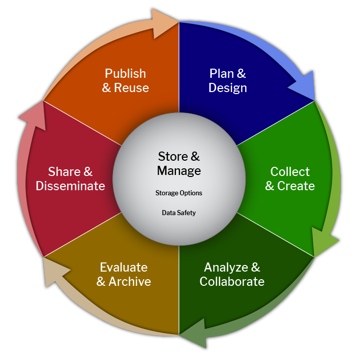
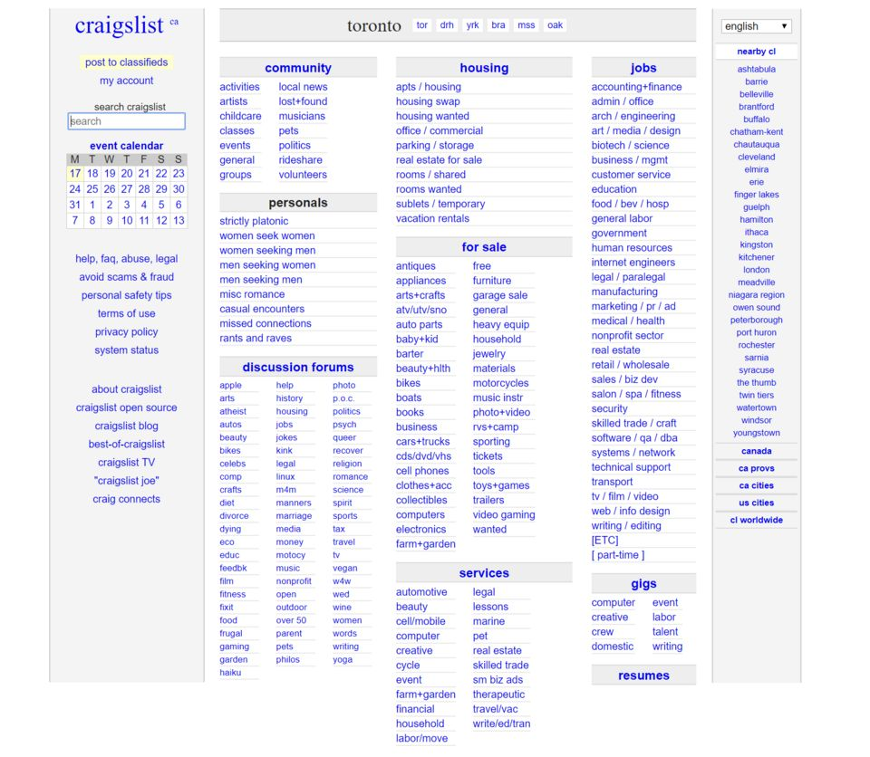

## Why data management plans matter

- Funders treat DMPs as proposal and reporting documents.
- Researchers get more value when they also use them as working plans.
- Good plans support reproducibility, ethical practice, and long-term reuse of the work.

> Plans change. Data, methods, collaborators, access conditions, and research questions shift over the life of a project. A DMP written once and filed away stops being useful.

::: {.notes}
Welcome the class and thank the instructor for the invitation. Briefly
introduce your current role at UCLA Library (unit name is in flux with the
2026 reorg, confirm your own title and affiliation before class rather
than assuming the old Data Science Center name still applies).

Set the tone early: a DMP is not paperwork you write once. The practical
framing in this lecture builds on Library Carpentry's DMP101 module
[@lc_dmp101].

**Prompt:** ask students to think of the last time they documented a data
workflow, and how specific they actually were.
:::

## The research data lifecycle

::: {.columns}
::: {.column width="42%"}
{fig-alt="A circular wheel diagram of the research data lifecycle. Six outer segments, arranged clockwise: Plan and Design, Collect and Create, Analyze and Collaborate, Evaluate and Archive, Share and Disseminate, Publish and Reuse. A central hub reads Store and Manage."}

[Cioffi, Goldman & Marchese, Harvard, CC BY-NC 4.0](https://doi.org/10.5281/zenodo.8076168)
:::
::: {.column width="58%"}
- Planning shapes every later stage, but a plan has to flex as the project moves through the cycle.
- The DMP is the connective document. It links what happens today to what happens after the grant ends.
- Notice "Store & Manage" sits at the center, not as one stage among others. Storage and data safety touch every phase, not just one step in the loop.
:::
:::

::: {.notes}
Ask which stage tends to cause the most trouble for their disciplines.
Use this to set up why plans change instead of standing still: new
collaborators, a change in method, a repository that turns out not to fit,
a funder requirement that shifts mid-project.

Diagram is CC BY-NC 4.0 from Harvard Medical School / Harvard University
[@cioffi_lifecycle2023]. Non-commercial classroom use is covered by the
license; if this deck is ever repurposed for anything commercial, swap it
out first.
:::

## Anatomy of a strong plan

::: {.columns}
::: {.column width="50%"}
| Section | What it covers |
|---|---|
| Data description | Types, formats, and approximate volume |
| Documentation | Metadata standards, READMEs, data dictionaries |
| Storage and backup | Where data live during the project, and how they're protected |
| Sharing and access | Timelines, access conditions, and licensing or reuse terms |
:::
::: {.column width="50%"}
| Section | What it covers |
|---|---|
| Consent and compliance | Privacy, consent, <abbr title="Institutional Review Board">IRB</abbr>, contractual, and legal constraints |
| Repository and preservation | Where data land long-term, and how they stay usable |
| Roles, retention, and cost | Who's responsible, how long data are kept, and what it costs |
:::
:::

::: {.notes}
Walk through this quickly and connect each row to a real workflow rather
than treating it as compliance text.

Keep storage, synchronization, backup, and preservation conceptually
distinct: storage is where data live day to day, sync keeps copies
consistent across devices, backup protects against loss, and preservation
is a longer-term commitment to keep data usable after the project ends.
They're often handled by different tools and different people.

Mention that some funders allow data-management costs to be budgeted
directly into a proposal (storage, curation time, repository fees).
:::

## Weak and strong plan language

**Sharing**

::: {.columns}
::: {.column width="50%"}
::: {.callout-warning icon="false" title="Weak"}
"Available upon request."
:::
:::
::: {.column width="50%"}
::: {.callout-tip icon="false" title="Strong"}
"De-identified survey data will be published in UCLA Dataverse under an appropriate reuse license within six months of project end."
:::
:::
:::

**Storage**

::: {.columns}
::: {.column width="50%"}
::: {.callout-warning icon="false" title="Weak"}
"Data will be backed up regularly."
:::
:::
::: {.column width="50%"}
::: {.callout-tip icon="false" title="Strong"}
"Data are stored on UCLA Box during the project, with version history retained, and archived to the department's research storage at project close."
:::
:::
:::

::: {.notes}
Small phrasing differences reveal whether the researcher has actually
thought through logistics. Encourage students to use language that
describes concrete actions and named tools rather than intentions.

Two deliberate corrections from earlier versions of this lecture: don't
present CC BY as the automatic license for all data, use "an appropriate
reuse license or terms of use," since the right choice depends on the
data and the funder. And don't promise "nightly backup" for UCLA Box
unless you can point to an authoritative UCLA source confirming that.
Version history is the claim we can actually stand behind.
:::

## How librarians support researchers

- Review and strengthen DMP language before submission.
- Map funder and repository requirements to the specific project.
- Advise on metadata, formats, identifiers, and licensing.
- Point to campus infrastructure and services: UCLA Dataverse, Redivis, Merritt, and others.
- Identify issues that need referral, and connect researchers with IRB, privacy, information security, legal, contracts, or tribal authorities.

> Librarians usually identify and route compliance questions. They don't make binding legal, IRB, security, or tribal-governance decisions themselves.

::: {.notes}
This is a boundary worth stating plainly, since students sometimes assume
a librarian's sign-off carries legal weight it doesn't. The librarian's
job is to spot the issue early and get it to the right expert, not to
adjudicate it.

Also flag that FAIR and open are not synonyms. Data can be FAIR
(findable, accessible, interoperable, reusable) under restricted access
conditions. "Accessible" in FAIR refers to accessible metadata and a
clear access mechanism, not necessarily open access to the data itself.

Transition: "Let's look at what this support looks like on the ground."
:::

## The data interview

- Modeled on the reference interview, but focused on data.
- Ask early: what formats, what volume, how sensitive, who owns it.
- The answers shape both the plan and the project's long-term access.

::: {.notes}
This is often the first concrete step a librarian takes with a new
project, usually before the DMP itself is drafted. It surfaces storage,
sharing, or compliance gaps while there's still time to change course.
:::

## Common problems and librarian interventions

- Vague or missing sharing statements &rarr; propose a specific repository, timeline, and license.
- Weak metadata and documentation &rarr; recommend a standard, a README template, a data dictionary.
- Unclear storage or backup strategy &rarr; separate "where data live" from "how they're protected."
- Unresolved ethics or consent questions &rarr; flag early, route to IRB or privacy office.
- Undefined roles &rarr; name who deposits, who maintains, who answers questions after the grant ends.

::: {.notes}
Transition: "Here are three examples from UCLA practice that show how
these issues surface in review." These are anonymized composites drawn
from UCLA practice, not independently published case studies, so
describe them that way rather than as established external facts.
:::

## Case: scraping Craigslist for housing data

::: {.columns}
::: {.column width="42%"}
{fig-alt="Screenshot of the craigslist Toronto housing and classifieds listing page, showing category links for community, housing, jobs, for sale, services, and discussion forums."}
:::
::: {.column width="58%"}
- A project proposed collecting rental listings and landlord contact information to study post-incarceration housing access.
- Craigslist's current terms prohibit automated or manual collection of its content without permission [@craigslist_tos].
- The plan also raised privacy and possible human-subjects questions.
- The team paused collection while it reconsidered its method and consulted the appropriate campus offices.
:::
:::

::: {.notes}
Don't say a librarian "legally prohibited" or "personally halted" the
project. What happened is that librarian review surfaced the terms-of-use
conflict early, before the proposal went out, giving the team time to
redesign the method.

Craigslist's Terms of Use prohibit collecting content "via robots,
spiders, scripts, scrapers, crawlers, or any automated or manual
equivalent (e.g., by hand)" [@craigslist_tos]. Worth reading that clause
aloud, students are often surprised manual collection is covered too.

Takeaway: ethical and legal checks belong in every DMP review, not just
ones that look sensitive on their face.
:::

## Case: drone imagery over tribal land

- A project proposed depositing aerial imagery collected over tribal land in a public repository.
- The team recommended pausing the deposit while the researchers consulted the relevant tribal nation and appropriate campus experts.
- The <abbr title="Collective Benefit, Authority to Control, Responsibility, Ethics">CARE</abbr> Principles for Indigenous Data Governance helped frame questions about collective benefit, authority to control, responsibility, and ethics.

::: {.notes}
Don't say the librarians "required" CARE. Describe CARE as a governance
framework the team used to ask better questions, and as a complement to
FAIR rather than a replacement for it: FAIR is about making data usable,
CARE is about who has authority over it and who benefits.

Say "the relevant tribal nation," not a generic "tribal representatives."
Which nation matters, and treating it as interchangeable undercuts the
point of the case.

Takeaway: data sovereignty and ethical deposit decisions go hand in hand,
and the library's role here was to slow the process down enough for the
right consultation to happen.
:::

## Case: linking voter and clinical data

- A project combined purchased historical voter data (names, addresses) with clinical data from UCLA Health, held under restricted access.
- Linking identifiable voter records with clinical information changed the risk profile of the combined dataset.
- Review covered the data-use agreement, IRB protocol, consent and permitted uses, access controls, the approved computing environment, and the sharing and retention plan.

> Data linkage can make the combined dataset more sensitive than either source considered separately.

::: {.notes}
Avoid suggesting the problem arose simply because the work crossed
disciplines. The issue was the linkage and the resulting identifiability,
not the fact that voter data and clinical data came from different
fields. Mention how the DMP itself had to be revised once the linkage was
proposed, since the original plan didn't anticipate it.
:::

## What changed in federal DMP requirements in 2026

- <abbr title="National Science Foundation">NSF</abbr>: starting April 27, 2026, <abbr title="Data Management and Sharing Plan">DMSP</abbr>s are completed as a form in Research.gov instead of uploaded as a two-page PDF [@nsf2026dmsp].
- <abbr title="National Institutes of Health">NIH</abbr>: a simplified, structured DMS Plan format applies to applications submitted for due dates on or after May 25, 2026. It uses mostly yes/no questions, a short limitations section, and a data-type-and-repository table [@nih2026structured].
- NIH: starting October 1, 2026, changes to an approved DMS Plan are reported through the <abbr title="Research Performance Progress Report">RPPR</abbr> instead of a separate prior-approval request [@nih2026rppr].
- Structured forms make plans easier to validate. They aren't automatically a complete machine-actionable DMP, and some in the field warn that funder-specific structured formats could fragment the DMP ecosystem unless they can still interoperate with each other [@force11_future_dmps2026].

::: {.notes}
The controlling notice takes precedence over any older page that still
describes the two-page PDF upload, check the notice date if a student
finds conflicting guidance.

NIH's simplified format came out of a review of over 1,100 submitted DMS
Plans that found many ran long and included unnecessary narrative detail
[@nih2026structured]. NIH expects active awards to transition to the new
reporting approach during FY 2027.

The RPPR change [@nih2026rppr] retires the old DMS Prior Approval Request
module in eRA Commons, worth mentioning if any students have used it.

The closing point draws on an April 2026 Upstream/FORCE11 piece
[@force11_future_dmps2026] that's still the freshest substantive
commentary on this as of the lecture date: NSF and NIH each built their
own structured format rather than a shared one, and the piece argues for
splitting a DMP into a lightweight proposal-stage plan versus a fuller
"living" plan maintained post-award, which lines up well with the UCLA
workflow slide coming up.
:::

## A UCLA planning and review workflow

1. Researcher drafts a funder-specific plan.
2. Librarian reviews it and identifies questions or referrals.
3. Project staff implement the storage, documentation, access, and consent commitments.
4. The plan is updated as methods, data, collaborators, or restrictions change.
5. Data and related outputs are deposited, preserved, restricted, or disposed of as promised.
6. The project reports progress and changes to the funder.

::: {.notes}
Present this as a loop, not a one-way pipeline, step 4 feeds back into
steps 1 through 3 continuously over the life of the project, not just
once at the start.
:::

## DMPTool demonstration

- Log in through UCLA's institutional single sign-on.
- Open a current NIH or NSF template and show how institutional fields populate automatically.
- Show the <abbr title="Open Researcher and Contributor ID">ORCID</abbr> connection: a registered plan gets a persistent DMP ID and can appear as a work on the creator's ORCID record.
- Show where a plan can link to project outputs, such as a dataset or publication, once they exist.

::: {.notes}
Keep this under 10 minutes and keep it visual.

Test the exact workflow before class each year, DMPTool has been
updating its institutional sign-on and its NIH/NSF templates through
2026, and features can shift. If research-output linking or a specific
template field can't be reliably demonstrated live, use a screenshot
instead and say so.

**Question for the class:** which section do you think most researchers
struggle to complete?
:::

## From a static document to a machine-actionable plan

- A conventional DMP is written mainly for a person to read.
- A machine-actionable DMP represents key facts in structured fields that systems can exchange, validate, and update: ORCID iDs, <abbr title="Research Organization Registry">ROR</abbr>s, funder and award identifiers, DMP IDs, dataset <abbr title="Digital Object Identifier">DOI</abbr>s, repository identifiers, licenses, access conditions, retention periods, and costs.
- Example chain: a researcher creates a plan in DMPTool &rarr; DMPTool registers a DMP ID as a DOI &rarr; the plan connects to the researcher's ORCID record &rarr; a dataset later gets its own DOI &rarr; that DOI is added as a related output &rarr; DataCite can expose the relationships among researcher, plan, project, and output [@datacite_dmpid; @dmptool_madmp].

> Machine-actionable doesn't mean fully automated. Structured information can reduce repeated data entry and connect systems, but ethical decisions, consent restrictions, and repository suitability still need human judgment.

::: {.notes}
A DMP ID is technically a DOI with resourceTypeGeneral set to
`OutputManagementPlan`, available since DataCite schema 4.4
[@datacite_dmpid].

The RDA DMP Common Standard provides the interoperability model behind
this [@rda_dmp_standard]. Make clear it doesn't impose any funder's
specific business rules, it's a shared way to express DMP content, not
a policy.

If there's time, mention that this isn't just a DMPTool feature: the EU's
OSTrails project published a standardized API (built on the same RDA
standard) in April 2026 for exchanging maDMPs between different
institutions' tools and repositories, not just within one platform
[@ostrails_dmpif2026]. Useful for showing the trend is bigger than one
vendor.
:::

## Matching data with repositories and services

- **UCLA Dataverse**: citable data publication, with both open and restricted-file workflows [@ucla_dataverse_re3data].
- **Dryad**: curated publication of openly shareable research data, free to UC researchers and archived long-term through Merritt [@cdl_dryad].
- **Redivis**: controlled-access data management and analysis platform, built for data with real privacy or governance constraints [@redivis_docs].
- **Merritt**: the UC system's preservation repository, generally reached through an organizational account or a service like Dryad rather than direct self-service deposit.
- Domain repositories, identified through funder or disciplinary guidance, for data with a natural community home.

::: {.notes}
Distinguish two words students tend to conflate: "sensitive" describes
the data and its risks, "restricted" describes an access condition.
Marking a dataset restricted doesn't by itself make sensitive data safe
or appropriate to deposit, the sensitivity has to be addressed first.

Don't imply Merritt is a self-service destination for any UCLA
researcher walking in the door. It's infrastructure other services sit
on top of.
:::

## Metadata, documentation, and persistent identifiers

- Descriptive and disciplinary metadata make a dataset findable and interpretable.
- READMEs, data dictionaries, and codebooks explain what's inside and how it was produced.
- Version and provenance notes track how the data changed over time.
- Persistent identifiers such as DOIs, ORCID iDs, and RORs identify and resolve people, places, and things.

> A DOI identifies and resolves an object. Its metadata describes the object and how it relates to other things. The DOI itself isn't metadata.

::: {.notes}
This replaces an older, vaguer framing ("metadata is what turns data
into knowledge") with something more precise: metadata and documentation
are what make data interpretable and reusable by someone who wasn't in
the room when it was collected.
:::

## Software gets its own treatment

- NSF's DMP guidance explicitly lists software alongside data, samples, and other materials as something a plan must address. NIH's policy covers "scientific data," but code needed to interpret or reproduce that data usually rides along with it.
- Some funders go further and require a separate Software Management Plan (SMP) for projects producing substantial code [@ssi_smp].
- Give software the same three things data gets:
  - **License**: pick one before you publish, don't leave it implicit.
  - **Identifier**: a `CITATION.cff` file (GitHub reads it natively) or a Zenodo / Software Heritage DOI.
  - **Documentation**: a README, a dependency list, enough context for someone else to rerun it.

::: {.notes}
FAIR4RS (2022), a joint RDA/FORCE11/ReSA effort, adapts the FAIR
principles specifically for software, since software's differences from
data (it runs, it has versions, it depends on other software) mean the
data-FAIR guidance doesn't map cleanly onto it [@fair4rs2022].

Two citation-metadata formats come up constantly: `CITATION.cff` is a
YAML file, human-writable, and both GitHub and Zenodo read it directly.
CodeMeta is a JSON-LD format, better suited if the software needs to be
indexed by registries like Software Heritage or bio.tools, or needs to
document dependencies and runtime requirements [@codemeta_cff].

Software Heritage is worth naming as the software equivalent of a
preservation repository: as of 2026 it's a recognized UN digital public
good archiving over 27 billion source files, and every archived object
gets a SWHID, a content-derived identifier that lets it be cited and
retrieved independent of any single forge (GitHub, GitLab, etc.)
[@software_heritage2026].
:::

## Exercise: match the data to a plan

**Small groups, 10 minutes.** For each example, discuss:

- What information is missing from the plan?
- Should the data be open, restricted, embargoed, or not deposited at all?
- What repository or service might fit?
- What approvals or agreements might apply?
- What documentation and identifiers does it need?

1. Sensitive clinical interview transcripts
2. Large 3D scans or drone imagery
3. Open survey data in CSV
4. Research code and software

::: {.notes}
Walk around while groups discuss. Push back gently if a group converges
on one "obvious" answer too quickly, most of these examples support more
than one reasonable path depending on details the prompt doesn't specify,
and that ambiguity is the point.
:::

## Takeaways, resources, and contact

- DMPs work best as living plans, not one-time paperwork.
- Librarians identify and route compliance questions. They don't make binding legal, IRB, security, or tribal-governance decisions.
- Structured, machine-actionable plans connect systems, but human judgment still decides what's ethical and appropriate.

**Resources:** [DMPTool](https://dmptool.org) &middot; [UCLA Dataverse](https://dataverse.ucla.edu) &middot; [re3data.org](https://re3data.org) &middot; [FAIRsharing.org](https://fairsharing.org)

**Contact**\
Tim Dennis, UCLA Library (tdennis@library.ucla.edu)\
Jamie Jamison, UCLA Library (jamison@library.ucla.edu)

Adapted from Library Carpentry *DMP101* (CC BY 4.0) [@lc_dmp101]. 2025 version archived at [doi.org/10.5281/zenodo.17360886](https://doi.org/10.5281/zenodo.17360886) [@dennis_jamison_2025].

::: {.notes}
Open discussion before this slide: what patterns did students see in the
weak plans, and how could library support have improved them? Summarize
briefly, thank the instructor and the class, and take final questions.
:::

## Glossary {.smaller}

::: {.columns}
::: {.column width="50%"}
**DMP**: Data Management Plan\
**DMSP / DMS Plan**: Data Management and Sharing Plan (NSF's and NIH's specific term for a DMP)\
**NSF**: National Science Foundation\
**NIH**: National Institutes of Health\
**IRB**: Institutional Review Board\
**DOI**: Digital Object Identifier, a persistent ID for a published object\
**ORCID**: a persistent ID for a researcher, not an institution\
**ROR**: Research Organization Registry, a persistent ID for an institution
:::
::: {.column width="50%"}
**RDA**: Research Data Alliance\
**RPPR**: Research Performance Progress Report (an NIH reporting form)\
**FAIR**: Findable, Accessible, Interoperable, Reusable (data principles, not a synonym for "open")\
**CARE**: Collective Benefit, Authority to Control, Responsibility, Ethics (Indigenous data governance)\
**maDMP**: machine-actionable DMP\
**SMP**: Software Management Plan\
**SWHID**: a Software Heritage identifier for a specific piece of archived code\
**CC BY / CC BY-NC**: Creative Commons license types. BY requires attribution; BY-NC also restricts commercial use.
:::
:::

::: {.notes}
Not meant to be read aloud. Point students to this slide (and the
hoverable `<abbr>` tags throughout, when viewing on a screen rather than
projected) if terminology gets in the way of the discussion.
:::

## References {.scrollable}

::: {#refs}
:::
